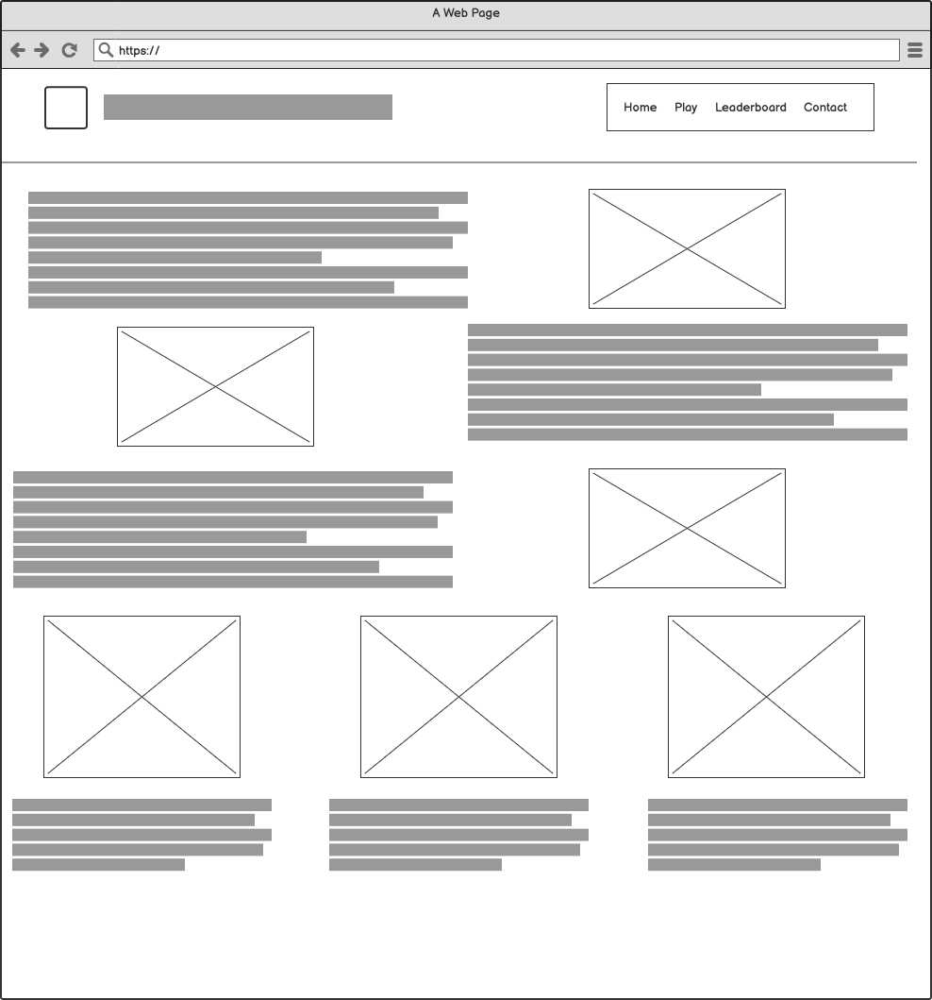
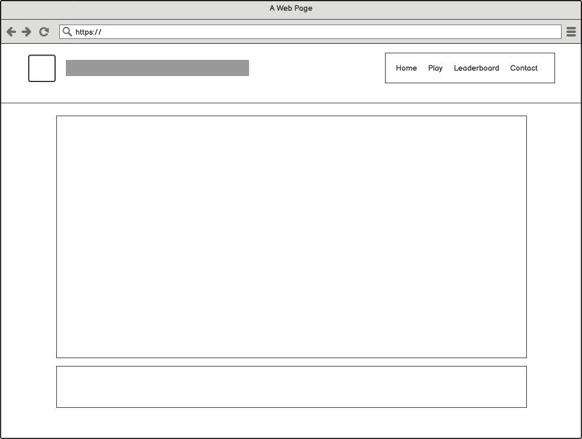
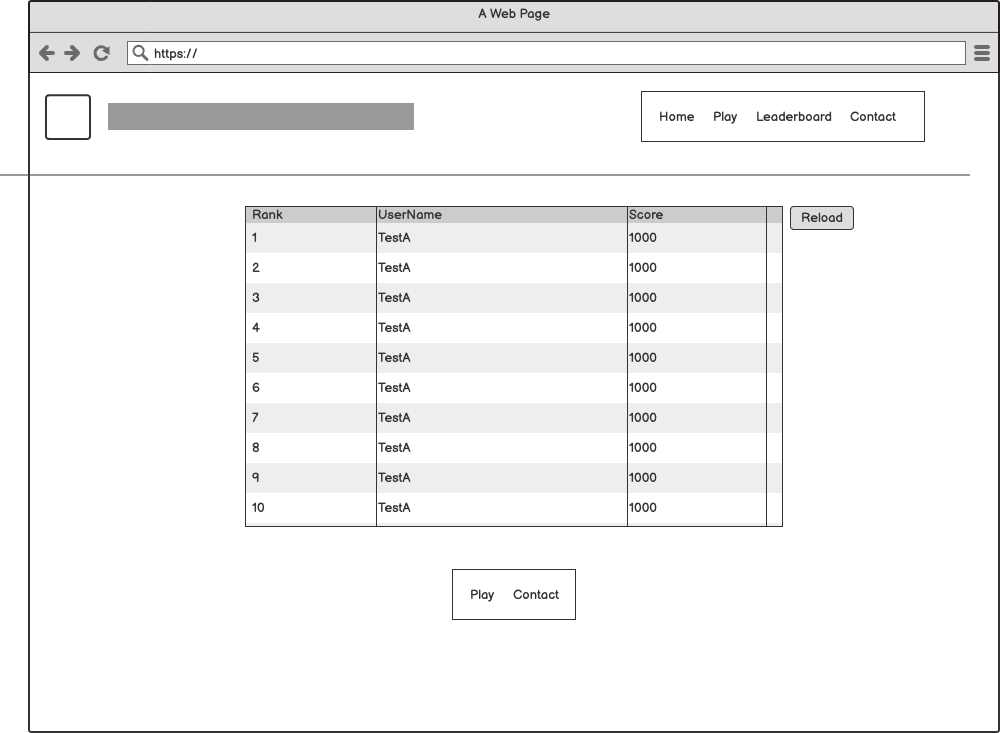
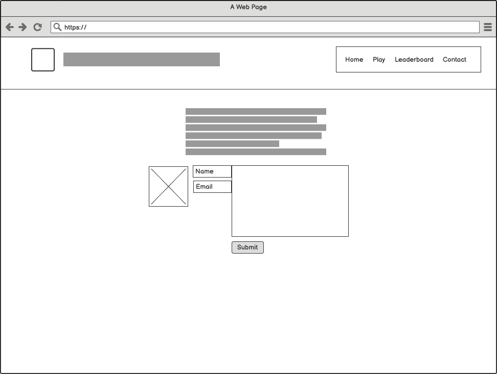

<h1 align="center">The METAL GEAR GAUNTLET</h1>
[Milestone Project](https://evane123.github.io/milestone-project-2/home.html)

This project is inspired by my love and enjoyment of the [Metal Gear®](https://en.wikipedia.org/wiki/Metal_Gear) series.

The Metal Gear Gauntlet is a website is for fans of the series, or anyone else who needs a 15 minute break from whatever they are focusing on. In the [PLAY](https://evane123.github.io/milestone-project-2/play.html) Section, the user will have to run the through a gauntlet of Javascript browser games, to try and claim the top score!
The current live leaderboard can be found here: [Leaderboard](https://evane123.github.io/milestone-project-2/leaderboard.html)

## UX 
Core Audience: 
This site is for anybody looking to burn 15 minutes winding down or anybody looking to reach the top score spot.

The goal of the website: 
The goal of this site is to offer up a multi-game point based gauntlet, built mostly in Javascript to highlight my understanding of the language, and how it can be used for general enjoyment. It also is designed after a game series I’ve enjoyed and would like to convey my appreciation for. 

________________ 
The Design of the Site: 
I wanted a basic design for this site, leaning heavily on the themes and colours from Metal Gear Solid 4: Guns of the Patriots - with the majority of my assets and color schemes being taken directly from the game series. 

_______________
Content Sections; 
Home
- Intro to the site
- Intro to each game
- Intro to the Leaderboard
- Intro to the Contact me section


Play
- codec
- Welcome screen
- Game 1 Rules
- Game 1 wrap-up
- Game 2 Rules
- Game 2 wrap-up
- Game 3 Rules
- Game 3 wrap-up

Leaderboard
- Pre-loaded Leaderboard table 

Contact 
- Thank you for visiting & get in touch section 
- Form 

WireFrames

- This design changed during development and I forgot to update the wireframe. 





## Features
Shared
- Timer
- Hamburger Menu 
- Underline Nav-List element
- UpdateCodec

Play
Game 1
Rock Paper Scissors
- LoadGame
- Create Grid (Both player options)
- Display Round Result
- IncreaseScore
- Check Streak

Game 2
Wack-An-Ocelot 
- LoadGame
- Create Grid 
- DisplayRandomOcelot
- IsSpecialCheck
- UpdateScore
- DisplayRaiden

Game 3
Mantis Memory Game 
- Load
- RandomSort (array of pictures)
- Create Grid
- FlipCard
- CheckMatch

Leaderboard
- Fetch Leaderboard
- Sort Leaderboard
- Display Leaderboard 
- Add navigation buttons to Leaderboard Table

Contact
- Contact Me to Discord Webhook
### Existing Features
insertUnderline()

hamburgerMenu()

GetScores()
- Using fetch and an open API for storing JSON Objects [jsonbin.io](https://jsonbin.io/) I was able to populate the leaderboard on-load. 

UpdateScores()
- Using fetch and a PUT method, I'm replacing the stored JSON object array with the previously Fetched objects, and using.push to add the
    the passed in object. 
### Features Left to Implement
- I would like to add more games. I will likely continue work on this in my own time, adding more MGS Themed javascript-based games such as;
    - Tetris
    - Blackjack (Beat the dealer) 
    - Pacman-like roaming game to collect items 
    - Space invaders styled game themed 

- I would also like to implement a database for the leaderboard, and offer a login and game-history section where the user can see previous scores and attempts. 
- I would like to implement a real Emailing function, instead of logging to console and wiping the form. 

## Technologies Used TODO: 
- [HTML](https://www.w3schools.com/html/)
    - The project uses **HTML**.
- [CSS](https://www.w3schools.com/)
    - The project uses **CSS**.
- [Javascript](https://www.javascript.com/)
    - The project uses **Javascript**.
- [Bootstrap](https://getbootstrap.com/)
    - The project uses **Bootstap** to simplify the content structure and provide pre-built functionalities such as navigational templates and grid-classes.
- [Jquery](https://jquery.com/)
    - The project uses **Jquery**.
- [Github](https://www.github.com/)
    I used **Githu** as my Version Constrol Software. 
- [Gitpod](https://www.gitpod.io/)
    I used **Gitpod** for active development
- [Balsamiq](https://balsamiq.cloud/)
    I used **Balsamiq** to construct my Wireframes
- [Hexcol](https://hexcol.com/)
    I used **Hexcol** for reviewing color shades and values. 
- [Live Server](https://marketplace.visualstudio.com/items?itemName=ritwickdey.LiveServer)
    I used **Live Server** with **Gitpod** to ensure live update in my testing environment throughout development. This extension offers an on-save server reload feature, which I use in my everyday work. 

## Testing
#Hamburger menu: 
Issue: 
* I initially had issues resetting the animation for each navigation `<li>` element
```
function hamburgerMenu {
    const burg = document.querySelector(".burgermenu");
    const navElement = document.querySelector(".navlinks");
    const navlinks = document.querySelectorAll(".navlinks li");

    burg.addEventListener('click', () => {
        navElement.classList.toggle("burgeractive");
        navlinks.forEach((link, i) => {
                link.style.animation = `navLinkFade 0.3s ease forwards ${i / 7}s`;
        });
        burg.classList.toggle("toggle")
    });

}

```
Resolved: 
* This was resolved with a conditional statement to reset the style animation to nothing. 3 
```
...hamburgerMenu = () => {
    const burg = document.querySelector(".burgermenu");
    const navElement = document.querySelector(".navlinks");
    const navlinks = document.querySelectorAll(".navlinks li");

    burg.addEventListener('click', () => {
        navElement.classList.toggle("burgeractive");

        navlinks.forEach((link, i) => {
            if (link.style.animation) {
                link.style.animation = ``;
            } else {
                link.style.animation = `navLinkFade 0.3s ease forwards ${i / 7 + 0.4}s`;
            }
        });
        burg.classList.toggle("toggle")
    });
}
```
#Leaderboard: 
- Issue: 
I didn't have one specific issue with this, moreso just issues in ordering of calls and updating the table on-load with the newest top-10

- Resolved 
loadTable() resoslved this by allowing me to clear out all rows
below the table row header if populated as well as insert the passed in data object `([{user:"",score:""},{user:"",score:""}])`
```
function loadTable(data) {
    //let table = document.getElementsByClassName("leaderboardtable")
    let table = document.getElementById("leaderboardtable");
    console.log(table.rows.length)
    for (let i = table.rows.length - 1; i >= 1; i--) {
        table.deleteRow(i);
    }

    for (let i = 9; i !== -1; i--) {
        let row = table.insertRow(1);
        let cell1 = row.insertCell(0);
        let cell2 = row.insertCell(1);
        let cell3 = row.insertCell(2);
        cell1.innerHTML = `${i+1}`;
        cell2.innerHTML = `${data[i].username}`;
        cell3.innerHTML = `${data[i].score}`;
    }
}

```
#Linking the Games together 
Issue: 
The original idea was to have each individual game and it's element-creation processes be imported by the main.js file. 
A function here would sort through the mini-games, and present them with a Loader in-between. 
On this loader pain, I intended to have instruction-text displayed as if someone was typing/speaking to the end user. 

### Navigation / Hamburger Menu
- Using Media Queries in CSS and Javascript functions, the hamburger icon is mimicking an animation when the end user clicks on it. 
It goes from 3 lines, to an X. 


## Deployment
- Github pages
I've opted to use [Github Pages](https://evane123.github.io/milestone-project-2/) 

The reason for this decision is due to ease of use. With my code already on Github, using Pages will save essential time avoiding the set up of multiple services and server space. 

In the future, I would like to host my website(s) myself. This would be experience, and to offer a more professional feel to the site. 

https://evane123.github.io/milestone-project-2/### Content

### Media

### Acknowledgements
The inspiration for this site came from trying to come up with an engaging idea for putting Javascript to use. 
- Note: I would say I had higher expectations for what I wanted to accomplish with this site. I believe I got very bogged down with the styling, asset gathering and tedious information that's needed to highlight my learning. 

## Credits
[kecode.info](https://keycode.info/)
- Helped with testing keyevents
[jsonbin.io](https://jsonbin.io/)
- Made updating the leaderboard much easier. 

The StackOverflow Community: 
- [exported classes](https://stackoverflow.com/questions/52787527/javascript-creating-an-event-listener-for-an-exported-class)
- [Tables](https://stackoverflow.com/questions/7271490/delete-all-rows-in-an-html-table)
and many more
